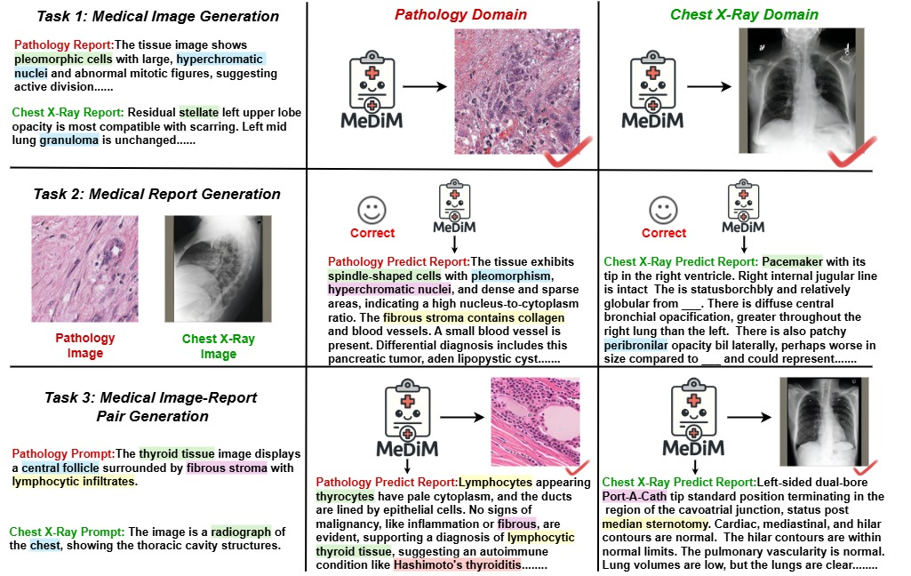
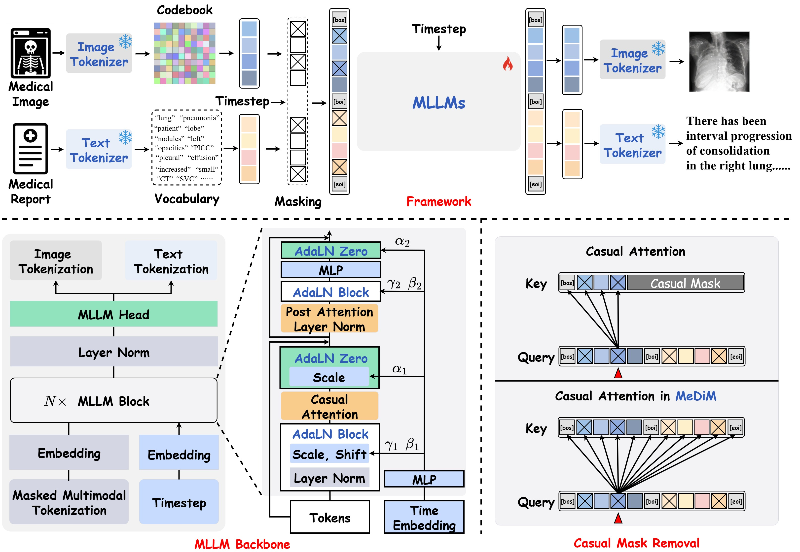

<p align="center">
  
</p>

# Discrete Diffusion Models with MLLMs for Unified Medical Multimodal Generation
<span>
<a href="https://arxiv.org/abs/2504.06897"></a>
<a href="https://opensource.org/licenses/MIT"></a>  
<a href="https://jwmao1.github.io/MeDiM_web/"></a>
<a href="https://huggingface.co/spaces/JohnWeck/medsegfactory"></a>
</span>

Code for the paper [Discrete Diffusion Models with MLLMs for Unified Medical Multimodal Generation](https://arxiv.org/abs/2504.06897) will be available soon. 

### About this repo:

The repository contains the official implementation of "MeDiM".

## 🏥 Introduction 

> Recent advances in generative medical models are often constrained by modality-specific scenarios that hinder the integration of complementary evidence, such as imaging, pathology, and clinical notes. This fragmentation limits their development to true foundation models that empower medical AI agents to learn from and predict across the full spectrum of biomedical knowledge. To address these challenges, we propose **{MeDiM}**, the first medical discrete diffusion model that learns shared distributions across different medical modalities without requiring modality-specific components. MeDiM unifies multiple generative tasks: it flexibly translates between images and text or jointly produces image–report pairs across domains in response to user prompts. It builds on a discrete diffusion framework that unifies vision and language representations by modeling their shared probabilistic distribution. To empower the diffusion process to support unified and versatile medical generation, we employ a multimodal large language model (MLLM) as the diffusion backbone, leveraging its rich prior knowledge and cross-modal reasoning abilities. Because MLLMs are trained with causal (autoregressive) masking while diffusion denoising benefits from bidirectional context, MeDiM introduces two key designs: 1) _removing the causal attention mask_ to enable a fully bidirectional information flow essential for mutual alignment, and 2) _injecting continuous timestep embeddings_ to make the MLLM aware of the diffusion steps. Extensive experiments validate MeDiM as a unified foundation model capable of high-fidelity medical generation across various modalities, including medical image generation (16.60 FID on MIMIC-CXR; 24.19 FID on PathGen) and report generation (0.2650 METEOR on MIMIC-CXR; 0.2580 METEOR on PathGen). In addition, the jointly generated medical image-report pairs improve downstream task performance (+6.43 % BLEU-1, +18.57 % BLEU-2, +31.58 % BLEU-3, and +4.80 % METEOR in PathGen), enabling the use of multimodal inputs and the production of coherent, clinically grounded outputs.
<br>



## 🔥 News/TODO
- [x] [Paper](https://arxiv.org/abs/2504.06897) is released on ArXiv.
- [x] Training code.
- [ ] Dataset upload.
- [ ] Pretrained weight of MeDiM.
- [ ] Inference code.

## 🧑‍⚕️ Framework 

> **Overview of the MeDiM architecture.** The framework integrates an MLLM backbone within a discrete diffusion process for unified medical multimodal generation. During the forward process, data is tokenized and diffused over timesteps. The MLLM is then trained to reverse this process. Key architectural adaptations, including causal attention removal, timestep embeddings, and AdaLN, adapt the autoregressive MLLM for the bidirectional denoising required for unified medical generation.
<br>



## Getting Started

Step1. To install the dependencies, run:
```bash
# create new anaconda env
conda create -n MedDiM python=3.10
conda activate MedDiM 

# install packages
pip install -r requirements.txt
pip install torch==2.7.0 torchvision==0.22.0 torchaudio==2.7.0 --index-url https://download.pytorch.org/whl/cu128
```

Step2. Prepare pretrain checkpoint, run:
```bash
# download VQVAE config and weight
cd ./models
wget -P chameleon/ https://huggingface.co/spaces/Junfeng5/Liquid_demo/resolve/main/chameleon/vqgan.ckpt 
wget -P chameleon/ https://huggingface.co/spaces/Junfeng5/Liquid_demo/resolve/main/chameleon/vqgan.yaml

# download Liquid 7B
huggingface-cli login
huggingface-cli snapshot download Junfeng5/Liquid_V1_7B --local-dir ./models/Liquid_V1_7B --local-dir-use-symlinks False

# download Llama-2-7b-hf
huggingface-cli login
huggingface-cli snapshot download NousResearch/Llama-2-7b-hf --local-dir ./models/Llama-2-7b-hf --local-dir-use-symlinks False
```

Step3. Fixing `num_hidden_layers: 10` of `config.json` in ./models/Liquid_V1_7B.

Step4. MedUnidisc training, run:
```bash
# training
accelerate launch  --num_processes 8 --multi_gpu --main_process_port=$RANDOM main.py +experiments='[large_scale_train]' debug=true loader.batch_size=1 data_path_dir_train=./dataset/pathgen/train data_path_dir_val=./dataset/pathgen/test data_mimic_dir_train=./dataset/mimic-cxr/data data_mimic_dir_val=./dataset/mimic-cxr/test model.vqgan_config=./models/chameleon/vqgan.yaml model.vqgan_ckpt=./models/vqgan_ckpt model.llama_ckpt=./models/Llama-2-7b-hf model.liquid_ckpt=./models/Liquid_V1_7B
```

Step5. Find the latest ckpt path, run:
```bash
# find ckpt path
python find_latest_ckpt.py ./medunidisc/outputs/outputs/debug
```

Step6. Resume MedUnidisc training, run:
```bash
# resume
accelerate launch  --num_processes 8 --multi_gpu --main_process_port=$RANDOM main.py +experiments='[large_scale_train]' debug=true loader.batch_size=1 data_path_dir_train=./dataset/pathgen/train data_path_dir_val=./dataset/pathgen/test data_mimic_dir_train=./dataset/mimic-cxr/data data_mimic_dir_val=./dataset/mimic-cxr/test model.vqgan_config=./models/chameleon/vqgan.yaml model.vqgan_ckpt=./models/vqgan_ckpt model.llama_ckpt=./models/Llama-2-7b-hf model.liquid_ckpt=./models/Liquid_V1_7B
```

## 🙏 Acknowledgement

Deeply appreciate these wonderful open source projects: [unidisc](https://github.com/alexanderswerdlow/unidisc), [pathgen-1.6m](https://github.com/PathFoundation/PathGen-1.6M), [mimic-cxr](https://physionet.org/content/mimic-cxr/2.0.0/).

## 🩺 Citation 

If you find this repository useful, please consider giving a star ⭐ and citation 💓:

```
@misc{mao2025medsegfactorytextguidedgenerationmedical,
      title={MedSegFactory: Text-Guided Generation of Medical Image-Mask Pairs}, 
      author={Jiawei Mao and Yuhan Wang and Yucheng Tang and Daguang Xu and Kang Wang and Yang Yang and Zongwei Zhou and Yuyin Zhou},
      year={2025},
      eprint={2504.06897},
      archivePrefix={arXiv},
      primaryClass={cs.CV},
      url={https://arxiv.org/abs/2504.06897}, 
}
```

